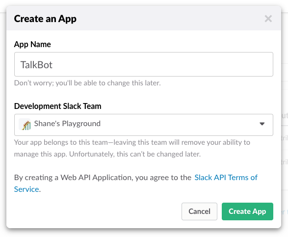
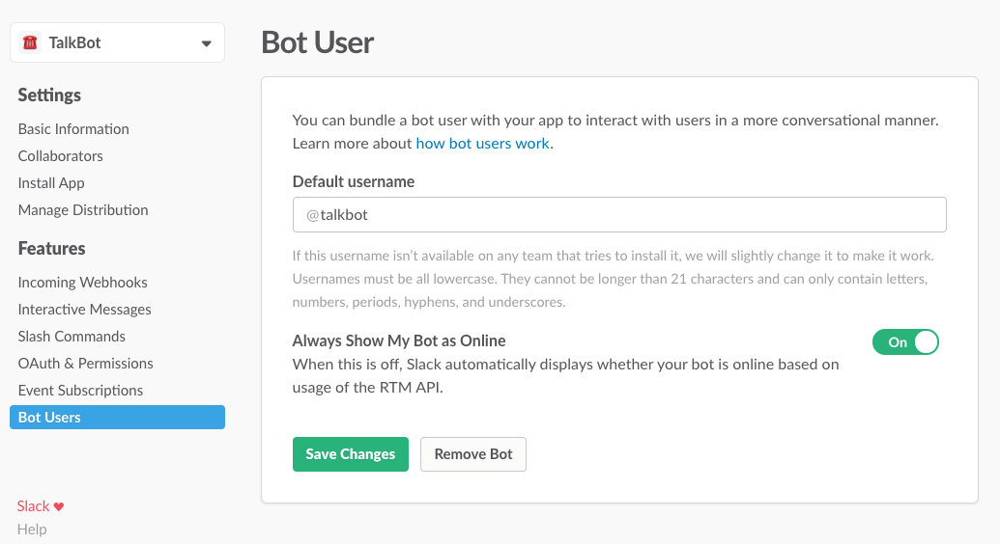
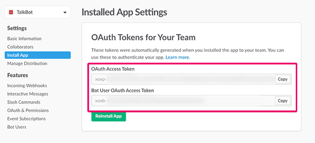
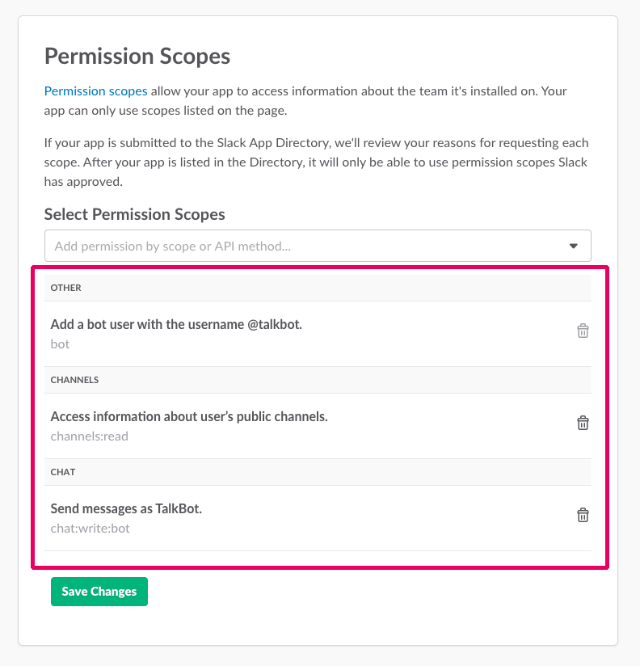
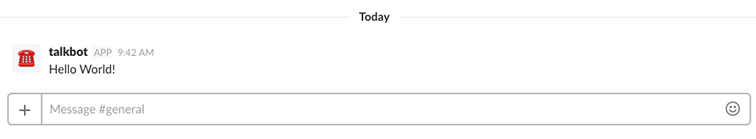

# Section 01: Setting up your Slack Bot 🤖

* [Section 00: Overview and Introduction](../README.md)
* **Section 01: Setting up your Slack Bot** 👈
* [Section 02: Integrating your Bot with Twilio](section-02.md)
* [Section 03: Adding Threads to Your Conversations](section-03.md)
* [Section 04: Responding to Message Events](section-04.md)
* [Section 05: Responding to SMS via Slack](section-05.md)
* [Section 06: Adding Onboarding and Message Menus](section-06.md)

Before we dig into Twilio integrations and making our bot useful, we have to set up and configure an app with proper access permissions. Slack has a few different APIs you can use for bot-building, but we'll be using the Events and Web APIs. We can easily acess and use these APIs with the [Slack SDK](https://github.com/slackapi/node-slack-sdk) and the [Slack Events API module](https://github.com/slackapi/node-slack-events-api)

> 💡 *If you want to learn about the differences between the Slack APIs, you should [check out the API documentation](https://api.slack.com/slack-apps).*

## Starting the Code
To start, we're going to create a new node project and install some project dependencies. Create a new folder to hold your app and, inside of that folder, initialize your project.

```sh
$ npm init
```

> 💡 *If you don't have Node.js and NPM up and running, take a look at [NPM's tutorial](https://docs.npmjs.com/getting-started/installing-node)*

Now, we're going to create an `index.js` file in the root of our project. This is the entry file for our application, where our bot's logic and routing will take place. Below, I've added some setup code that you can copy. You can see that we're going to have to install some dependencies.

```js
/**
 * Dependencies:
 * Dotenv, Express, BodyParser, Slack Web Client, Slack Events API
 */

require('dotenv').config();

const express = require('express');
const bodyParser = require('body-parser');
const WebClient = require('@slack/client').WebClient;
const createSlackEventAdapter = require('@slack/events-api').createSlackEventAdapter;

```

> 💡 Body parser is middleware for express, which allows us to parse and handle requests easily. To learn more, [check out their documentation](https://github.com/expressjs/body-parser).

To install the necessary dependencies, use the following command in your project folder:

```sh
$ npm install express dotenv body-parser @slack/client @slack/events-api --save
```

> 🔑 *If you don't want to install the dependencies manually, you can just replace the `dependencies` in your project's `package.json` with the one in this repo, then run `npm install`.*

## Hooking it up to Slack 🔌
Now let's create an app on Slack and add the API credentials to our Node project. To create a new app, go to [the Slack developer site](https://api.slack.com/apps) and sign in to the team that you'll be testing your app on.

Go ahead and click `Create New App`. This will bring up a dialog box, where you can name your app. Make sure to select the team you want to test your app on from the dropdown menu, under `Slack Development Team`. Don't worry, we talk about installing your app onto other teams in [section 6](section-06.md). After you're finished, click the `Create App` button.



We'll need your App Credentials for using OAuth later on. Let's grab the Client ID and Client secret from `App Credentials` in `Basic Information`.

Create a new file, `.env` in your Node project. This is going to hold all of the private configurations for your app. We'll add your Client ID, Client Secret, and Verification Token here, along with other tokens you'll need later. Paste your credentials and give them environmental variable names. We'll read them into our application using the `dotenv` package we installed.

```
SLACK_CLIENT_ID=<your-client-id>
SLACK_CLIENT_SECRET=<your-client-secret>
SLACK_VERIFICATION_TOKEN=<your-verification-token>
```

Now, let's add a Bot User to our app that will be able to send our Twilio messages to a Slack channel. Click on `Bot Users` > `Add a Bot User` and give your bot a default username.



After you add a bot user to your app, you'll want to install it onto your team. Click `Install App` and give the app permission to join your team. After it joins, you'll be able to access its authorization token. Under your app's setting page, click `Install App` again, and copy the OAuth Access Token and the Bot User OAuth Access Token that appeared.



Now we'll add those tokens to our `.env` file as well.

```
SLACK_BOT_TOKEN=xoxb-<your token>
SLACK_AUTH_TOKEN=xoxp-<your token>
```

> 🔑 *In this repository, there's an `.env.example` file. It has labels for all of the tokens and credentials you'll need throughout this tutorial.*

To retrieve and reference your tokens in the code, we'll add get our tokens in `index.js`. We'll use these tokens later when sending Slack messages.

```js
// Retrieve bot token from dotenv file
const bot_token = process.env.SLACK_BOT_TOKEN || '';
// Authorization token
const auth_token = process.env.SLACK_AUTH_TOKEN || '';
// Verification token for Events Adapter
const slackEvents = createSlackEventAdapter(process.env.SLACK_VERIFICATION_TOKEN);
```
> 💡 *You can see the last one, `slackEvents`, actually passing the Verification Token into a method. This will allow us to verify that the events we receive are from Slack. We'll use this more in [Section 04](section-04.md).*

## Configure Slack Clients
Next, we're going to use the `Client ID` and `Client Secret` to initialize two web clients. We need two because we'll need to make API calls on behalf of the bot user we set up. Using clients will make it simpler to send messages and use auth endpoints. In `index.js`, you'll want to add the following *after* you declare your Express app:

```js
// Slack web client
const web = new WebClient(auth_token);
const bot = new WebClient(bot_token);
```

## Adding Permission Scopes

Permission scopes are what allow you app to access certain information about whatever team your app is installed on. They allow access to different objects (`files`, `search`, `chat`, and `reactions`) with multiple scopes rather than giving an app full access to a team's information.

On the same page you got the tokens, scroll to `Permission Scopes`. Since we'll need to add a bot user, access public channels, and send messages with our bot, we'll subscribe to the `bot`, `channels:read`, and `chat:write:bot` scopes.



> 💡 *You can learn more about how Slack uses permission scopes [in the documentation](https://api.slack.com/docs/oauth-scopes)*

Since we added new permission scopes, we'll have to reinstall the app onto our team. Afer you reinstall it, you should have the necessary permission scopes for the app. Now let's make your bot say hello world! 🤖

## Sending Messages

To make sure our bot is wired up properly, let's send a message. Copy the following code into your `index.js`. 

```js
// Post message to Slack
web.chat.postMessage('#general', 'Hello, world!', function(err, info) {
	if (err) console.log(err);
});
```

> 🔑 *We aren't going to be using this code at any other point in the tutorial. After you test that everything is working, you can delete this code.*

You should now be able to run your bot!

Go to your project's root folder and run your bot by starting your Node project.

```sh
$ node index.js
```

You should see your bot's post in `#general`.



> ⚠️  *Make sure you add your bot to `#general` in your team. You can do this easily by typing `/invite @<BOT_NAME>` in `#general` in the Slack team you installed your app on.*

## Adding SMS to our Application
In Section 2, we're going to add functionality to our application by integrating Twilio, which will allow us to receive and send SMS messages to Slack.

* [Section 00: Overview and Introduction](../README.md)
* **Section 01: Setting up your Slack Bot** 👈
* [Section 02: Integrating your Bot with Twilio](section-02.md)
* [Section 03: Adding Threads to Your Conversations](section-03.md)
* [Section 04: Responding to Message Events](section-04.md)
* [Section 05: Responding to SMS via Slack](section-05.md)
* [Section 06: Adding Onboarding and Message Menus](section-06.md)

