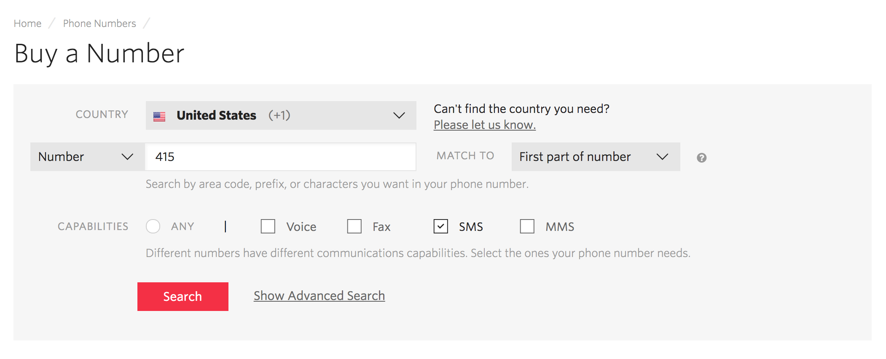
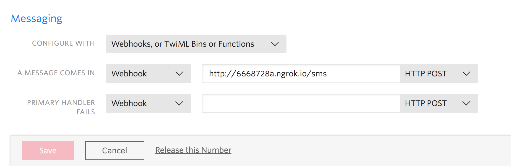
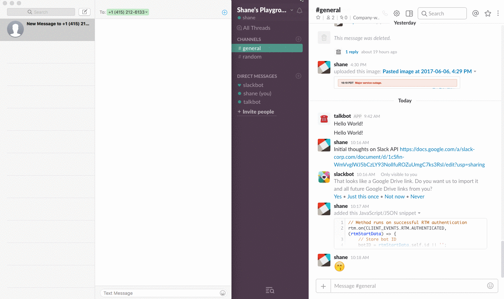

# Section 02: Integrating your Bot with Twilio 📞

* [Section 00: Overview and Introduction](../README.md)
* [Section 01: Setting up your Slack Bot](section-01.md)
* **Section 02: Integrating your Bot with Twilio** 👈
* [Section 03: Adding Threads to Your Conversations](section-03.md)
* [Section 04: Responding to Message Events](section-04.md)
* [Section 05: Responding to SMS via Slack](section-05.md)
* [Section 06: Adding Onboarding and Message Menus](section-06.md)

In [Section 01](section-01.md), we set up a Slack bot, configured it, and added it to our team. By the end of this section, you'll be able to text a Twilio number we set up and forward that message to Slack using your bot! However, before we can send messages, we have to do some Twilio setup and configuration.

> 💡 *Twilio is a service that allows you to easily build apps that use voice, video, messaging, and authentication. Although we'll only be using the messaging API from Twilio for this project, you can dig into their other uses and APIs in [Twilio's documentation](https://www.twilio.com/docs).*

## Setting up your Twilio App

We'll start by setting up and configuring a Twilio phone number associated with our app. We'll use this number to forward SMS texts to our Slack team. Start by [logging into Twilio](https://www.twilio.com/login) (or sign up if you don't have an account).

Once you're logged in, you'll want to go to [Buy a Number](https://www.twilio.com/console/phone-numbers/search) under [Phone Numbers](https://www.twilio.com/console/phone-numbers). Here, you'll search for an available phone number. It doesn't matter where your phone number is as long as it has SMS capabilities enabled.



> 💡 *Under Twilio's free trial, you can only obtain one phone number. So if you need more than one number, you'll have to upgrade your account.*

Now that we have a Twilio phone number, we need authorize our application. Go to [Twilio's console](https://www.twilio.com/console), and copy your Account SID and Auth Token into the `.env` we created in [Section 1](section-01.md). We'll use these credentials later when we are sending messages using Twilio from Slack.

```
TWILIO_SID=<Account SID>
TWILIO_AUTH_TOKEN=<Auth Token>
```

While we're in our code, we want to install the Twilio SDK using NPM. Install it using

```sh
$ npm install twilio --save
```

and add it to your project like we did the other dependencies:

```js
var twilio = require('twilio');
```

## Configuring your Express Server with Ngrok

Next, we'll need to configure a server so Twilio can send us the SMS messages sent to our Twilio number. To do this, we'll use Ngrok. If you've never used Ngrok before, [read through our tutorial on tunneling with Ngrok](https://api.slack.com/tutorials/tunneling-with-ngrok).

After you understand Ngrok, set up the express server and add some basic routing in our `index.js`:

```js
// Creates our express app
const app = express();
// Use BodyParser for app
app.use(bodyParser.urlencoded({extended: true}));
app.use(bodyParser.json());
// Slack web client
const web = new WebClient(auth_token);
const bot = new WebClient(bot_token);

// The port we'll be using for our Express server
const PORT = 4390;

// The channel we'll send TalkBot messages to
const channel = '#general'

// Starts our server
app.listen(PORT, function() {
	console.log('TalkBot is listening on port ' + PORT);
});

// Handles incoming SMS to Twilio number
app.post('/sms', function(req, res) {
	// Gets message from Twilio req
	let msg = req.body.Body ? req.body.Body : '';
	// Gets phone number from sender without leading plus sign
	let num = req.body.From ? req.body.From.slice(1) : '';

	// Sends message to Slack - in format <msg> from <phone number>
	sendMessage(msg + ' from ' + num, channel, num);
});

function sendMessage(text, channel, num) {
	// Send message using Slack Web Client
	web.chat.postMessage(channel, text, function(err, info) {
		if (err) {
			console.log(err);
		}
	});
}
```

In the above code, we created an express server with `express()`. Then, after our web clients, we set up an HTTP post route at `/sms` that will receive all of the messages sent to our Twilio phone number we set up earlier. We're taking the text sent to our number, storing it in a `msg` variable, and then sending it via the Web API we set up in [Section 01](section-01.md).

The `sendMessage()` function uses the same `postMessage` call we used in [section 01](section-01.md). All of the available calls for the Web API can be found [in the Web API documentation](https://api.slack.com/methods).

> 💡 *We'll use the `num` parameter in `sendMessage()` in [section 03](section-03.md). Don't worry about it now.*

Great! Now let's start an Ngrok server on the port we defined, `4390`. We can do this via command line by running:

```sh
$ ngrok http 4390
```

> 🔑 *The port number here doesn't matter, as long as you are consistent between Ngrok and your application.*

Copy the forwarding address of your Ngrok server and add it to your Twilio number's incoming message webhook. This can be done by going to the configuration page for your active number and pasting your Ngrok url to the `A Message Comes In` option under Messaging and click `Save`.



> ⚠️  *Ensure that you add `/sms` to the end of your url so that the messages are forwarding to the proper route in our node application.*

## Testing it Out
We should now be able to text our new Twilio number, and our message should go to `#general` in the Slack team that our app was added to 🤙



## Making Threads Work
In [Section 3](section-03.md), we're going to be configuring Firebase and adding threads to our application. This will allow us to keep track of multiple people texting our Twilio number in a smart and intuitive way.

* [Section 00: Overview and Introduction](../README.md)
* [Section 01: Setting up your Slack Bot](section-01.md)
* **Section 02: Integrating your Bot with Twilio** 👈
* [Section 03: Adding Threads to Your Conversations](section-03.md)
* [Section 04: Responding to Message Events](section-04.md)
* [Section 05: Responding to SMS via Slack](section-05.md)
* [Section 06: Adding Onboarding and Message Menus](section-06.md)