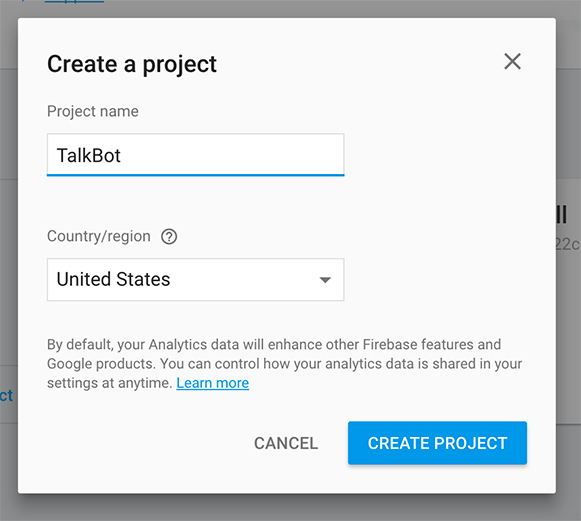
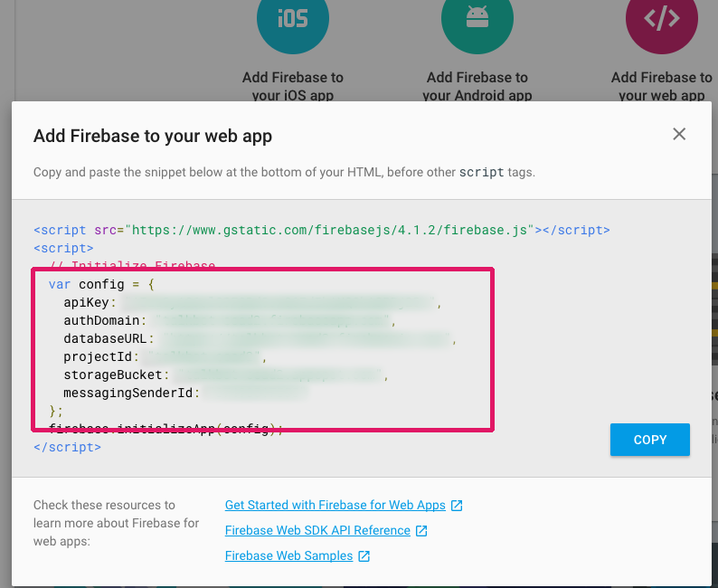

# Section 03: Adding Threads to Your Conversations 💬

* [Section 00: Overview and Introduction](../README.md)
* [Section 01: Setting up your Slack Bot](section-01.md)
* [Section 02: Integrating your Bot with Twilio](section-02.md) 
* **Section 03: Adding Threads to Your Conversations** 👈
* [Section 04: Responding to Message Events](section-04.md)
* [Section 05: Responding to SMS via Slack](section-05.md)
* [Section 06: Adding Onboarding and Message Menus](section-06.md)

In [Section 2](section-02.md), we configured a Twilio number to forward incoming messages using a webhook, which allowed us to send messages to Slack. In this section, we're going to make those messages useful by organizing them into threads. To do this, we'll configure an *extremely* simple database using [Firebase](https://firebase.google.com).

Using Firebase will allow us to store and reference phone numbers that have texted our Twilio number in the past, which allows us to add new messages to Slack threads. We'll also use it to store a configured channel ID (so we aren't just posting to `#general`). Let's dig in 🤓

## Setting up Firebase
To start, we'll set up Firebase. This will allow us to differentiate between users who are messaging a Twilio number for the first time versus someone who is following up (which we'll add to an existing thread). We can achieve this model by storing user data in simple key-value pairs:

> **phone-number** : *message-id*

This structure will allow us to reference a phone number's original message ID, which we'll use to add their new messages under a thread of the original. Later, when we mark a message as resolved using emoji reactions, we'll delete the user's key-value pair from the database.

We'll also store a channel ID to reference which channel the user wants TalkBot running in.

Let's start by setting up our database. Go to the [Firebase console](https://console.firebase.google.com) and click `Add project`. Type in the name of your app and then click `Create Project`. This will generate the necessary tokens to access our database. 



Firebase makes it really easy to access the generated config information. Click on `Overview` in the top left, and then `Add Firebase to your web app`. Copy the token values in the config JSON object and add them all to the `.env` file we created earlier.



> 💡 *Since firebase gives you the configuration information in JSON format, we'll have to copy just the values assign them names in our `.env`, which we'll use to access our tokens from our code. Keeping our tokens in our `.env` will make sure they are safe* 🔐

Finally, we're going to change the database rules. Although this shouldn't be done for public applications, we're going to make our database access public to make it easier for development. To do this, go to `Database` > `Rules`. Here, we'll set read and write to `true` (or *public*):

```js
// These rules give anyone, even people who are not users of your app,
// read and write access to your database
{
  "rules": {
    ".read": true,
    ".write": true
  }
}
```

Now we'll add Firebase to our Node project. Add the following near the top of `index.js`:

```js
// Add firebase database
var firebase = require('firebase');
```

then install firebase via NPM:

```sh
$ npm install firebase --save
```

We'll then add the config from our `.env`. Under our app configuration and initialization, let's add in the config struct that will allow us to reference our Firebase database. This is the same config from the Firebase console.

```js
var config = {
	apiKey: process.env.FB_API_KEY || '',
	authDomain: process.env.FB_AUTH_DOMAIN || '',
	databaseURL: process.env.FB_DB_URL || '',
	projectId: process.env.FB_PROJECT_ID || '',
	storageBucket: process.env.FB_STORAGE_BUCKET || '',
	messagingSenderId: process.env.FB_MESSAGING_SENDER_ID || ''
};
```

Under that, we can actually initialize and reference our database:

```js
// Firebase initialization
var db = firebase.initializeApp(config).database();
```

> 💡 *This configuration and initialization is taken from Firebase's documentation. To better understand what's happening here, [check out their docs](https://firebase.google.com/docs/database).*

## Adding Some Helper Functions

I wrote some helper functions that we can use to get/write data to/from Firebase. Go ahead and copy these (*or write your own 🎉*) to the bottom of your `index.js`:

```js
/**
 * Firebase Access Methods:
 * Channel manipulation, user manipulation, and user retrieval
 */

// Update channel
function updateChannel(id) {
	db.ref('channel/id').set(id);
}

// Get channel
function getChannel() {
	const ref = db.ref('channel/id');
	ref.on('value', (snapshot) => {
		channel = snapshot.val();
	})
}

// Create user in Firebase
function createUser(num, id) {
	db.ref('users/' + num).set(id);
}

// Delete user in Firebase
function deleteUser(num) {
	db.ref('users/').child(num).remove();
}

// Get number from message ID in Firebase
function getNum(id) {
	return db.ref('users/').orderByValue().equalTo(id).once('value').then((snapshot) => {
		if (snapshot.val()) return Object.keys(snapshot.val())[0];
		return null;
	});
}

// Get thread ID from phone number in Firebase
function getID(num) {
	return db.ref('users/').child(num).once('value').then((snapshot) => {
		return snapshot.val();
	});
}
```

> 🔑 There are four basic functions to create/delete users in our database, and retrieve information using ID and phone number. We're storing all of our key/value pairs under the `users/` path in our database. `getNum()` and `getID()` both have callbacks since we need to wait until their data gets back from Firebase before it's used in our application.

## Threading it All Together

Now that we've set up firebase configuration, we can easily retrieve and store our data. Let's go back to our `app.post('/sms')` method in `index.js`. We're going to use our `getID()` method we created to check if a user that messages our Twilio number already exists in our database. 

If it does exist, we'll send their message to the thread of their original message. If it doesn't exist, we'll send their message, retrieve their message id, and create a user with their phone number and message id.

```js
// Handles incoming SMS to Twilio number
app.post('/sms', function(req, res) {
	// Gets message from Twilio req
	let msg = req.body.Body ? req.body.Body : '';
	// Gets phone number from sender without leading plus sign
	let num = req.body.From ? req.body.From.slice(1) : '';

	getID(num)
		.then((id) => {
			if (id) {  // User exists in database
				sendThread(msg, channel, id);
			} else { // User doesn't exist -- send message and create user
				sendMessage(msg, channel, num);
			}	
		})
		.catch(console.error);
});
```

You can see in the above code that we are fetching the message and phone number of sender from the Twilio request. We'll then check if the user has an ID in our Firebase database using `getID()`. If they do, we'll send this information to Slack in a thread of their original message. If they don't, we'll send it in a new message, and add the user to the database. We'll need to modify the `sendMessage()` method to call `createUser()` inside of it, and create the `sendThread()` method:

```js
function sendMessage(text, channel, num) {
	// Send message using Slack Web Client
	web.chat.postMessage(channel, text, function(err, info) {
		if (err) {
			console.log(err);
		} else {
			if (num) {
				// Create user in database
				createUser(num, info.ts);
			}
		}
	});
}

function sendThread(text, channel, id) {
	// Send message using Slack Web Client
	var msg = {
		thread_ts: id
	};

	web.chat.postMessage(channel, text, msg, function(err, info) {
		if (err) console.log(err);
	});
}
```

Now, if you send a message to your Twilio number, you'll see it appear in Slack. If you send another one, it'll appear in a thread under your original message. Wow 😲

## Adding Reactions and Deleting Users
In [Section 4](section-04.md), we'll be adding event listening, so you can mark a user as *complete*, which will delete that phone number from your database.

* [Section 00: Overview and Introduction](../README.md)
* [Section 01: Setting up your Slack Bot](section-01.md)
* [Section 02: Integrating your Bot with Twilio](section-02.md) 
* **Section 03: Adding Threads to Your Conversations** 👈
* [Section 04: Responding to Message Events](section-04.md)
* [Section 05: Responding to SMS via Slack](section-05.md)
* [Section 06: Adding Onboarding and Message Menus](section-06.md)