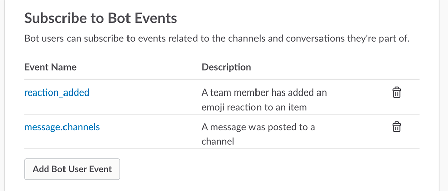
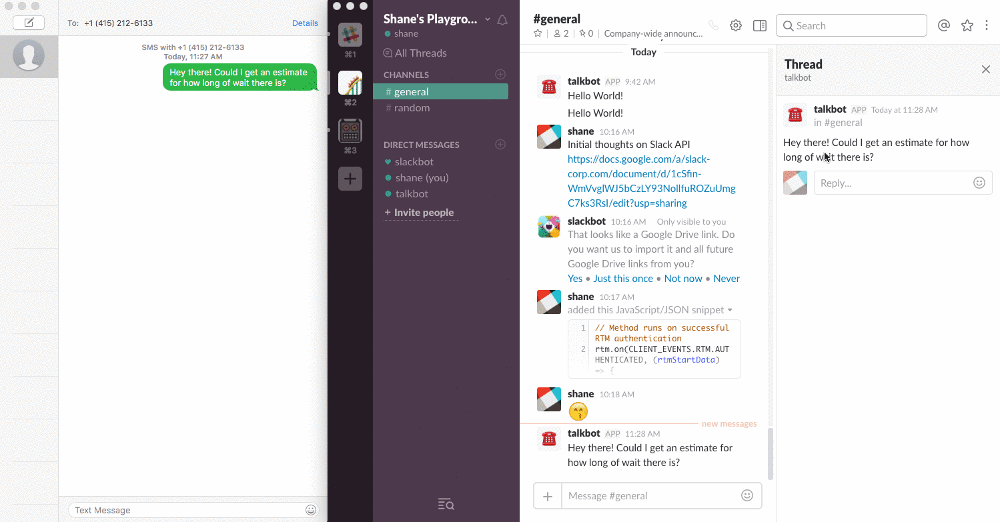

# Section 05: Responding to SMS via Slack

* [Section 00: Overview and Introduction](../README.md)
* [Section 01: Setting up your Slack Bot](section-01.md)
* [Section 02: Integrating your Bot with Twilio](section-02.md) 
* [Section 03: Adding Threads to Your Conversations](section-03.md)
* [Section 04: Responding to Message Events](section-04.md) 
* **Section 05: Responding to SMS via Slack** 👈
* [Section 06: Adding Onboarding and Message Menus](section-06.md)

In the [last section](section-04.md), we added user deletion on emoji reaction. Next, we're going to add is the ability to send SMS messages back to the user using a trigger `@talkbot <msg>` in an existing, active thread. We're going to achieve this by again using *event triggers*.

## Setting up Message Listener
First, just like we did for listening with reactions, we need to set up an event listener for all messages. Go to [Your Slack Apps](https://api.slack.com/apps). Click on your app, then on the left sidebar, go to `Event Subscriptions` (under Features).

Under your `reaction_added` event, you'll click `Add Bot User Event`. Choose the `message.channels`, and click `Save Changes`.



> 💡 *The new Bot Event will use the same path as our `reaction_added` event. We'll be able to see which is which in the request body.*

## Using the Message Listener
To start using our new message listener, we need to access our bot's Slack ID. We'll do this in our `app.listen()` method. Define a new variable, `botID`, that we can use later with our message listener. 

```js
// Holds channel ID
let channel;
// Holds bot user ID
let botID;
// The port we'll be using for our Express server
const PORT = 4390;

// Starts our server
app.listen(PORT, function() {
	console.log('TalkBot is listening on port ' + PORT);

	// Get userID for bot
	bot.auth.test()
		.then((info) => {
			if (info.user_id) {
				botID = info.user_id;
			}
		})
		.catch(console.error)
});
```

Above, we're using the `auth.test` endpoint to retrieve the proper user ID for the user bot.

Now, we can add a new event listener to check for messages with the `@talkbot <msg>` format. The following code receives incoming messages from the Events API module. It then checks if the `parent_user_id` (the thread's parent) is our bot, and finally if the message starts with the trigger `<@botID>`. 

```js
slackEvents.on('message', (event) => {
	let trigger = '<@' + botID + '>';
	if (event.thread_ts && event.text.startsWith(trigger)) {
		// Send message
	}
});
```

> 🔑 *Our trigger is `<@bot-id>` instead of `@bot-name` because Slack automatically tags the user based on their ID when someone mentions them in Slack. So that means when we see `@bot-name hello` in Slack, the text being passed in the request body is `<@bot-id> hello`*

## Sending an SMS via Twilio
Finally, we are going to connect all of the loose ends to send our first SMS 📱! First, let's prepare the Twilio client. We're going to use the tokens we added to our `.env` back in [Section 02](section-02.md). Near the top of `index.js`, require `twilio` and use a variable to hold the Twilio SID and Authorization token.

```js
// Require Twilio
const twilio = require('twilio');

// Twilio client authorization
const twilio_sid = process.env.TWILIO_SID || '';
const twilio_auth = process.env.TWILIO_AUTH_TOKEN || '';
```

Once you save `index.js`, install the Twilio SDK via command line.

```sh
$ npm install twilio --save
```

Below that, we'll initialize the Twilio client.


```js
// Initialize Twilio client using our Twilio SID and Authorization token
const twilioClient = twilio(twilio_sid, twilio_auth);
```

Now, we're going to create a new function `sendSMS()` that uses the Twilio client we intialized to send an SMS. We'll use our `getNum()` method to make sure a number exists using a message ID. If it does exist in our database, we'll send that message a number.

```js
function sendSMS(msg, id) { 
	getNum(id)
		.then((num) => {
			if (num) {
				twilioClient.messages.create({
					to: num,
					// from: your Twilio phone number
					from: '+14155555555',
					body: msg
				});
			}
		})
		.catch(console.error)
}
```

Finally, going back to our message listener, we'll call `sendSMS()` in our `if` statement from earlier. We've sanitized the message to uninclude the trigger, and fetched the thread ID from the event trigger.

```js
slackEvents.on('message', (event) => {
	let trigger = '<@' + botID + '>';
	if (event.thread_ts && event.text.startsWith(trigger)) {
		let msg = event.text.replace(trigger, '');
		sendSMS(msg, event.thread_ts);
	}
});
```

Now, you should be able to send SMS via Slack after the phone number is added to the database.



# Adding Message Menus and Distributing
Overall, our app is able to be used now. If you aren't interested in configuring OAuth for distribution or adding the ability for someone to pick a channel, you're done! 🎉

For everyone else...the last thing we'll do is set up the application for distribution. This involves setting up OAuth and prompting the installer via DM and message menus to configure TalkBot for their team.

* [Section 00: Overview and Introduction](../README.md)
* [Section 01: Setting up your Slack Bot](section-01.md)
* [Section 02: Integrating your Bot with Twilio](section-02.md) 
* [Section 03: Adding Threads to Your Conversations](section-03.md)
* [Section 04: Responding to Message Events](section-04.md) 
* **Section 05: Responding to SMS via Slack** 👈
* [Section 06: Adding Onboarding and Message Menus](section-06.md)