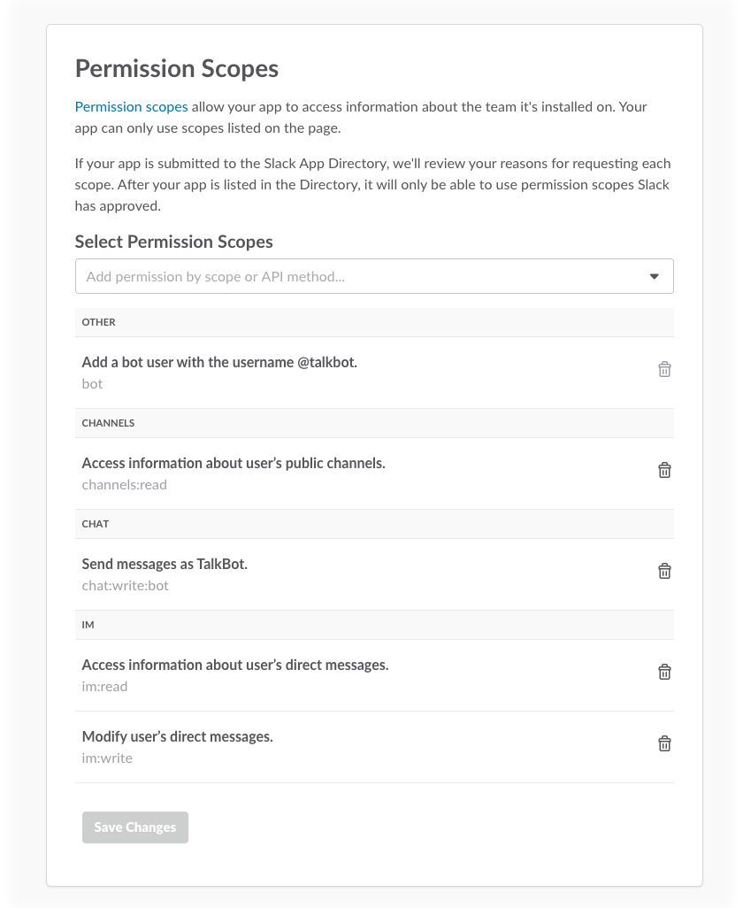
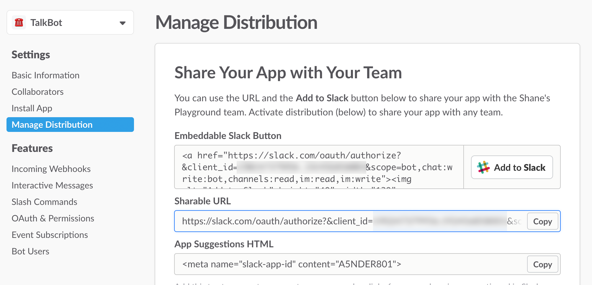

# Section 06: Adding Onboarding and Message Menus

* [Section 00: Overview and Introduction](../README.md)
* [Section 01: Setting up your Slack Bot](section-01.md)
* [Section 02: Integrating your Bot with Twilio](section-02.md) 
* [Section 03: Adding Threads to Your Conversations](section-03.md)
* [Section 04: Responding to Message Events](section-04.md) 
* [Section 05: Responding to SMS via Slack](section-05.md)
* **Section 06: Adding Onboarding and Message Menus** 👈

In [Section 05](section-05.md), we added the ability to respond with SMS from within Slack. Although not necessary for functionality, we're going to finish TalkBot by adding message menus to prompt the user for a default channel, and configure OAuth for app installation. To start, let's set up an Auth Redirect URL and set up an Add to Slack button for our app.

## Adding OAuth
To start, go to [Your Slack Apps](https://api.slack.com/apps). Click on your app, then on the left sidebar, click `OAuth & Permissions`. Add a redirect URL with your Ngrok server at a `/auth` endpoint. For me, it'd be:

> http://6668728a.ngrok.io/auth

Next, on the same page, add additional permission scopes to our application. We'll add `im:read` and `im:write` so we can directly message users on install.



Let's set up the `/auth` endpoint we just pointed to. Go to your `index.js` and add the following code:

```js
app.get('/auth', function(req, res) {
	web.oauth.access(process.env.SLACK_CLIENT_ID, process.env.SLACK_CLIENT_SECRET, req.query.code, function(err, info) {
		if (err) console.log(err);
		if (!err) {
			initBot(info.user_id);

			res.redirect('http://slack.com');
		}
	});
});
```

This looks pretty similar to the other calls we've been making using the Web API, but for authentication. You can see we're retrieving the user that added the bot in the callback, then passing it to a function we'll create called `initBot()`. On install, the user is redirected to [http://slack.com](http://slack.com).

Let's make the `initBot()` method. This is going to open a direct message (or IM) with the user that added the bot in order to figure out what channel our bot should be posting in. We'll save this channel in our Firebase database to use throughout our application.

Copy the following code below our `/auth` endpoint:

```js
function initBot(id) {
	// Open IM
	web.im.open(id, function(err, info) {
		if (err) console.log(err);
	});
}
```

## Adding Message Menus

The last thing we need to do for this part is configure interactive messages. First, go to your app. Go to your [app page](https://api.slack.com/apps) and select your app. On the sidebar, click `Interactive Messages`. Set up an endpoint at `/select` (for me this will be `http://6668728a.ngrok.io/select`. This will handle interactions with the message menu we're going to create. 


Now, go to your `index.js` and create the `/select` endpoint:

```js
app.post('/select', function(req, res) {
	let body = JSON.parse(req.body.payload);
	let id = body.actions[0].selected_options[0].value;
	res.json({text: 'Great, I\'ll send incoming messages there', replace_original: false});

	// Update Channel
	updateChannel(id);
});
```

This is going to receieve the channel that is selected in our message menu. We'll update the channel by passing the new channel ID into `updateChannel()`, which saves it in our Firebase database. Now let's create the actual message menu.

Create a new method, `installConfig()`. This is going to send a DM to the user. Add the following code:

```js
function installConfig(id) {
	let text = 'Hey there! I\'m TalkBot, a Slack bot you can use to send and receive messages from Twilio. Pick which channel you want me to send messages to. After you select the channel, make sure to invite me using the command `/invite @talkbot` in your selected channel.';
	let msg = {
		response_type: 'in_channel',
		attachments: [{
			fallback: 'Upgrade your Slack client to use messages like these.',
			color: '#ed2e3b',
			attachment_type: 'default',
			callback_id: 'simple_select',
			actions: [{
				name: 'channels_list',
				text: 'Which channel should I post to?',
				type: 'select',
				data_source: 'channels'
			}]
		}]
	};

	// Send initial IM to user
	web.chat.postMessage(id, text, msg, function(err, info) {
		if (err) console.log(err);
	});
}
```

> 💡 *This code is modified from the samples in the [message menu documentation](https://api.slack.com/docs/message-menus).*

The structure of our request is the same as earlier ones, like `postMessage`. But this an added `attachments` which we use to attach a channel picker. This is indicated in the `data_source` of our attachment actions. This can be overwhleming the first time you're using message menus, so be sure to [read through the documentation](https://api.slack.com/docs/message-menus) to understand what's being sent and received.

We need to call this in our `initBot()` method, so the user that installs your application receieves the direct message on install. Change the method to call our `installConfig()` method:

```js
function initBot(id) {
	// Open IM
	web.im.open(id, function(err, info) {
		if (err) console.log(err);

		installConfig(info.channel.id);
	});
}
```

One last thing we should do is call `getChannel()` in our startup function. This will make sure the channel we should be posting to stays up to date if the app restarts.

```js
// Starts our server
app.listen(PORT, function() {
	console.log('TalkBot is listening on port ' + PORT);

	// Get userID for bot
	bot.auth.test()
		.then((info) => {
			if (info.user_id) {
				botID = info.user_id;
			}
		})
		.catch(console.error)

	// Update channel
	getChannel();
});
```

## Using Install to Slack button

We have our authentication on login all setup. Now let's use a Slack button to test our app. Go to your app page and click the `Manage Distribution` tab on the left side. You can share this on whatever website you want. We can test our app by copying the shareable URL.



If you select a channel from the drop down, you'll be able to see a channel ID added to Firebase. Your app now communicates and reacts to installation on a team. If you continue development, you should look into saving the user's configuration information on authentication.

# Conclusion
Over 6 sections, we've created a Slack bot that listens to and responds to SMS messages using the Twilio SDK. We've learned how to utilize the Events and Web APIs, include Firebase and Twilio in our Slack applications, and utilize event listeners to add threads and interactivity to our bot. Naturally, what we covered was pretty bare bones, but hopefully it gave you a good overview into designing Slack bots and utilizing threads.

I'd love feedback on this tutorial. You can file an issue, submit a PR, or [message me on GitHub](http://github.com/shanedewael). Happy bot buidling 🤖🎉

* [Section 00: Overview and Introduction](../README.md)
* [Section 01: Setting up your Slack Bot](section-01.md)
* [Section 02: Integrating your Bot with Twilio](section-02.md) 
* [Section 03: Adding Threads to Your Conversations](section-03.md)
* [Section 04: Responding to Message Events](section-04.md) 
* [Section 05: Responding to SMS via Slack](section-05.md)
* **Section 06: Adding Onboarding and Message Menus** 👈
